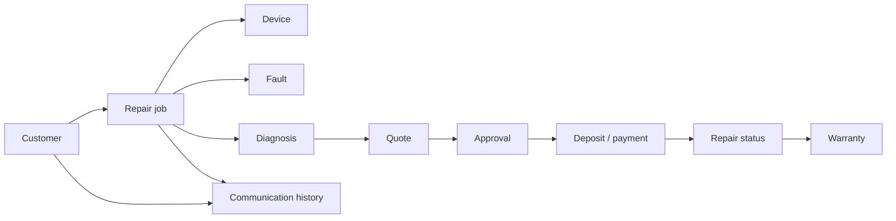

# Repair Tracker Architecture

**Status:** Design only. This document defines a possible future repair tracker;
it does not add persistence, routes, migrations, payment processing or a
production connection.

## Purpose and Boundary

The tracker would turn a WhatsApp or workshop enquiry into an internal record
that can be diagnosed, quoted, approved, repaired and communicated. The current
site remains a public, anonymous marketing page. Its repair form creates a
WhatsApp draft for customer review; it does not create a durable tracker record.

Production work must not begin until the operator has approved the retention,
privacy, staff access, audit, backup, payment and warranty requirements, and the
required persistence bindings are configured. D1 and R2 remain unconfigured in
`.openai/hosting.json` until that decision is complete.

## Core Model

Each record should have an opaque identifier, `createdAt`, `updatedAt`, and
`createdBy` or source metadata where applicable. Customer-facing values should
be separated from internal notes and access-controlled accordingly.

### Customer

Stores the minimum information needed to identify and contact the person:
name, phone, optional email, preferred contact channel, and consent or source
metadata. Avoid storing identity documents, unrelated contacts or payment-card
details. A customer may have many repair jobs.

### Device

Belongs to a repair job and records category, manufacturer, model, serial or
IMEI only when operationally necessary, accessories received, condition at
intake, and intake photographs or files. Sensitive device identifiers must be
masked in normal views and stored only with an approved retention policy.

### Fault

Captures the customer's reported symptoms, incident description, visible
condition, and intake timestamp. Customer wording should remain distinguishable
from technician conclusions so later changes do not rewrite the original
report.

### Diagnosis

Records technician findings, tests performed, suspected cause, required parts,
risks, estimated effort and the technician responsible. Diagnosis is versioned
or append-only after it is shared with the customer.

### Quote

Contains labour, parts, taxes or other approved charge components, currency,
total, validity period, assumptions and the diagnosis version it represents.
Revisions create a new quote rather than silently changing a quote already sent.

### Approval

Links a customer decision to a specific quote. Record approved, declined or
expired state, timestamp, actor, channel, and the exact quote version. Approval
must precede work that incurs the approved charge, except for separately
documented intake or diagnostic fees.

### Deposit / Payment

Represents an amount requested, amount received, method, reference, status,
currency and reconciliation metadata. It is a ledger record, not a place for
raw card data. A future payment provider and webhook trust model must be chosen
before implementation. No payment is collected by the current site.

### Repair Status

The job lifecycle should use explicit, ordered states such as `new`, `received`,
`diagnosing`, `awaiting-approval`, `approved`, `awaiting-deposit`, `in-repair`,
`awaiting-parts`, `ready-for-collection`, `collected`, `cancelled` and
`unrepairable`. Every transition records the prior state, next state, actor,
time and reason. Status must not be inferred from free-text communication.

### Warranty

Records the warranty offered for a completed repair: covered work or parts,
start and end dates, exclusions, claim status and resolution. Warranty terms
must be approved and shown to the customer before implementation; they are not
implied by the current marketing copy.

### Communication History

An append-only timeline of inbound and outbound contact attempts, channel,
sender, recipient, timestamp, message summary, delivery state and related
record. Store message bodies or attachments only when necessary and consented.
WhatsApp remains an external channel; a future integration must define webhook
verification, message ownership, redaction and retention before importing data.

## Relationships and Workflow

The repair job is the aggregate root for one device intake and its repair
workflow. A customer can have multiple jobs; each job has one intake fault and
may have multiple diagnosis and quote revisions, one approval decision per
quote version, multiple payment events, status transitions, warranty claims,
and communications. Files such as intake photographs should be referenced by
the device or job and stored in object storage only after R2 access and
retention rules exist.

## Privacy and Access Controls

- Collect only fields needed for intake, diagnosis, fulfilment, support and
  approved accounting.
- Show customers only their own jobs, approved quotes, payment receipts,
  status updates and applicable warranty information.
- Separate roles for intake staff, technicians, managers, finance and
  administrators; default to deny and grant the smallest required scope.
- Restrict customer contact data, device identifiers, internal diagnosis,
  margin, notes and payment reconciliation to the roles that need them.
- Require authenticated staff sessions, server-side authorization on every
  read/write, CSRF protection for browser writes, and rate limits for customer
  lookups and communications.
- Encrypt data in transit and use provider encryption at rest; keep secrets
  outside source control and never store raw payment credentials.
- Define consent, access/export, correction, deletion, legal-hold and retention
  procedures before collecting data. Provide a redaction path for exported
  communications and images.
- Treat WhatsApp, maps, payment and file providers as separate processors with
  explicit data-sharing and failure behavior.

## Auditability and Operations

Audit events should be append-only and tamper-evident. For each sensitive
operation record actor, role, timestamp, request or correlation ID, entity and
record ID, action, before/after values or a safe diff, reason, and source
channel. Do not put full phone numbers, message bodies, payment credentials or
private image URLs into general logs.

The system should support reconciliation of approvals, deposits, status changes,
and outbound communications without allowing staff to erase history. Define
backup/restore tests, export format, retention expiry jobs, failed webhook
handling, duplicate-event handling and an incident review process before
launch. Audit access itself should be audited.

## Deferred Implementation Decisions

Before this design becomes production code, decide the authoritative customer
identifier, staff identity provider and role source, D1 schema and migration
process, R2 file policy, WhatsApp integration boundary, payment provider and
reconciliation rules, warranty policy, notification templates, retention
periods, and customer privacy/consent language. Then configure bindings and
access policies, threat-model the workflows, and add end-to-end tests. Until
those decisions are recorded and approved, this tracker remains documentation
only.
